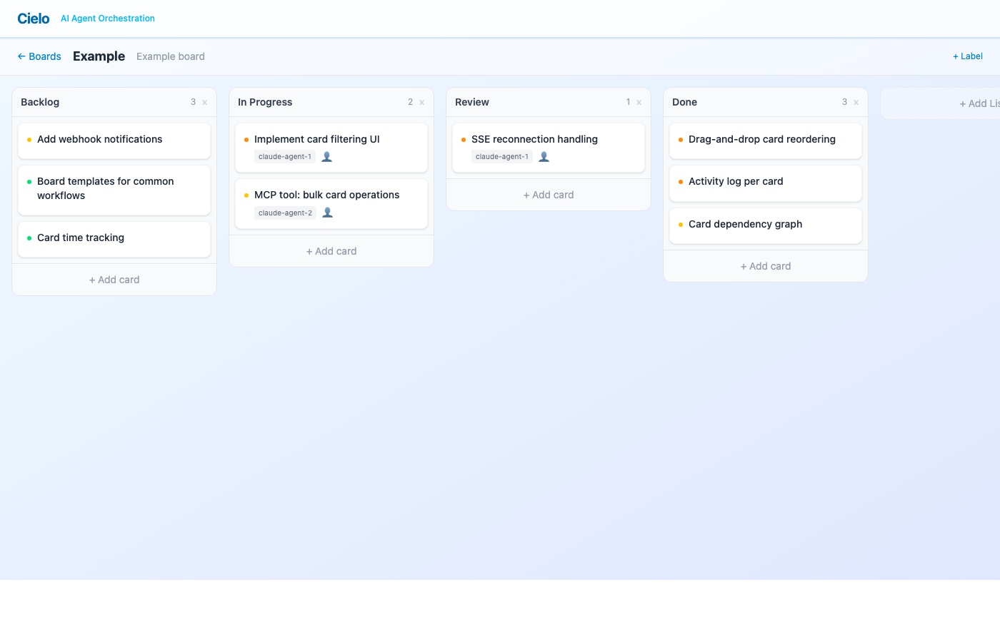

If you've spent any time running multi-agent AI workflows, you've probably noticed the coordination problem. One agent finishes a task. Another picks up something that depends on it — except it doesn't know the first task is done. A third agent duplicates work because there's no shared view of what's in progress. Chat threads don't cut it. Flat task lists don't either.

Cielo is my answer to that problem: a Kanban board purpose-built for AI agent orchestration, with a full MCP server baked in from day one.

*I'm Austin Ellingwood — I build tools at the intersection of infrastructure and AI. If you have questions or want to chat about this project, reach out at [austin@ellingwood.dev](mailto:austin@ellingwood.dev).*

## The Problem

Multi-agent workflows need shared state. Agents need to claim tasks, signal blockers, see what others are doing, and update their progress — all without stepping on each other. The spatial organization of a Kanban board maps naturally to this: columns represent workflow stages, cards represent units of work, and movement between columns signals state transitions.

Existing project management tools weren't designed for this. They assume human users, human-speed interactions, and browser-based workflows. What I needed was a tool that looks and works like Trello for the human operator, but exposes every operation through a structured API that AI agents can call directly.

That structured API is the [Model Context Protocol](https://modelcontextprotocol.io).

## What Cielo Does

At surface level, Cielo is a Kanban board. You get boards, lists, cards, drag-and-drop, labels, priorities, and due dates. If you've used Trello, the interface is immediately familiar.

Where it diverges is under the hood. Every feature was designed with agent interaction as a first-class concern:

- **Card assignment and status tracking** — agents claim cards by name and transition them through statuses: unassigned, assigned, in_progress, blocked, done.
- **Dependency graphs** — cards can declare blocking relationships. Agent A can't start its work until Agent B marks a prerequisite as done. The system tracks these as a directed graph.
- **Immutable activity log** — every mutation is recorded with actor attribution, action type, and a JSON detail payload. When three agents are working a board simultaneously, you can trace exactly who did what and when.
- **Real-time sync via SSE** — Server-Sent Events push updates to all connected clients. When an agent moves a card, the human watching the board sees it happen live.
- **Full-text search** — filter cards by title, assignee, status, or label within a board. Agents can query for their own assigned work or find unblocked tasks to pick up.

## MCP-First Design

The MCP server is the core of what makes Cielo useful for agent workflows. It exposes 20 tools — 7 read, 13 write — over JSON-RPC 2.0:

**Read tools** let agents survey the board: list boards, get card details with labels and dependencies, search for cards matching criteria, pull activity logs, and inspect the dependency graph.

**Write tools** let agents act: create cards, update status and priority, move cards between lists, assign themselves, add comments, manage dependencies, and attach labels.

Every write tool accepts an `actor` parameter. When `claude-agent-1` moves a card from "In Progress" to "Review," the activity log records exactly that — not a generic "card moved" entry. This attribution is what makes multi-agent debugging possible. You can reconstruct the full narrative of a workflow after the fact.

The practical loop looks like this: an agent calls `search_cards` to find unassigned work, `assign_card` to claim it, `update_card` to mark it in progress, and `move_card` when it's done. Other agents watching the board see the transitions in real time and adjust their own work accordingly.

## Under the Hood

Cielo compiles to a single Go binary that serves the REST API, MCP server, and React frontend from one process:

- **Go + Fiber** on the backend — minimal HTTP framework with enough structure for middleware, route groups, and SSE support.
- **SQLite with WAL mode** — zero-infrastructure persistence. The entire database is a single file. WAL mode gives concurrent read access while agents write simultaneously.
- **React 19 + Vite** frontend — TypeScript, Tailwind CSS, TanStack Query for server state, and dnd-kit for drag-and-drop. The frontend is compiled into the binary at build time via `go:embed`.
- **Event bus pattern** — an internal pub/sub system decouples HTTP handlers from real-time broadcast. Mutations publish events, SSE handlers fan them out to connected clients.
- **UUIDv7 identifiers** — time-ordered UUIDs that index efficiently and sort chronologically by default.

The architecture is deliberately simple. No external database, no message broker, no separate frontend server. One binary, one process, one SQLite file. Deploy it with Docker or just run the binary directly.

## A Couple Hours, Start to Finish

Here's the part that still catches me off guard: Cielo went from idea to working application in a couple of hours. Not a prototype. Not a mockup. A full-stack app with a React frontend, Go backend, SQLite persistence, real-time sync, drag-and-drop, and a 20-tool MCP server.

The process was conversational. I described the problem — agents need a shared coordination surface — and worked through the design in a back-and-forth Q&A with [Claude Code](https://docs.anthropic.com/en/docs/build-with-claude/claude-code/overview). What should the data model look like? How should dependencies work? What MCP tools do agents actually need? Each answer narrowed the scope and the next piece of code came out tighter for it.

There was no boilerplate phase. No scaffolding sprint. No wiring up a dozen libraries before writing the first line of actual logic. The conversation *was* the development loop: describe intent, review output, refine, repeat. The things that used to eat entire weekends — setting up a build pipeline, getting drag-and-drop working, implementing SSE correctly — collapsed into focused exchanges where I specified what I wanted and validated what came back.

I don't say this to diminish the engineering. The code is real, it handles edge cases, and it runs in production. But the economics of building software have shifted. A side project that would have taken weeks of evening-and-weekend effort now fits in an afternoon. The bottleneck isn't writing code anymore — it's knowing what to build.

## The Wave That's Coming

Cielo exists because I needed it for my own agent workflows. But I think it's an early example of a much larger pattern.

We're at the beginning of a wave of software that's built *for* AI agents, not just *by* them. The first generation of AI tooling focused on copilots — AI helping humans write code faster. The next generation is about infrastructure: tools, protocols, and coordination layers that agents need to operate autonomously.

MCP is a big part of why this is happening now. Before MCP, giving an agent access to an external system meant writing bespoke integration code. Now there's a standard protocol, and any tool that speaks it becomes instantly accessible to any compatible agent. That changes the calculus. Building an MCP server for your application isn't a speculative investment anymore — it's plugging into a growing ecosystem.

Think about what agents need that doesn't exist yet: structured work queues with dependency tracking, shared memory systems with conflict resolution, monitoring dashboards built for machine-speed operations, approval workflows where humans gate critical decisions. None of this is exotic technology. It's bread-and-butter software engineering, applied to a new class of user.

The interesting part is how fast these tools can be built now. Cielo took an afternoon. The next tool like it will take less. The barrier to shipping useful agent infrastructure is dropping fast enough that individual developers can meaningfully contribute to it — and that's when ecosystems tend to explode.

If you're building with agents and hitting coordination problems, you're not alone. The tooling is catching up.

## What's Next

Cielo handles the core orchestration loop, but there's more to build:

- **Webhook notifications** — fire HTTP callbacks on card state changes so external systems can react
- **Board templates** — pre-built layouts for common workflows like sprint planning and bug triage
- **Richer MCP tools** — bulk operations, workflow automations, and smarter card suggestions based on board state

The goal is to make Cielo the coordination layer for any multi-agent workflow — the place where agents and humans share a real-time view of what's happening, what's blocked, and what's next.

Source is at [github.com/ellingwood/cielo](https://github.com/ellingwood/cielo).
